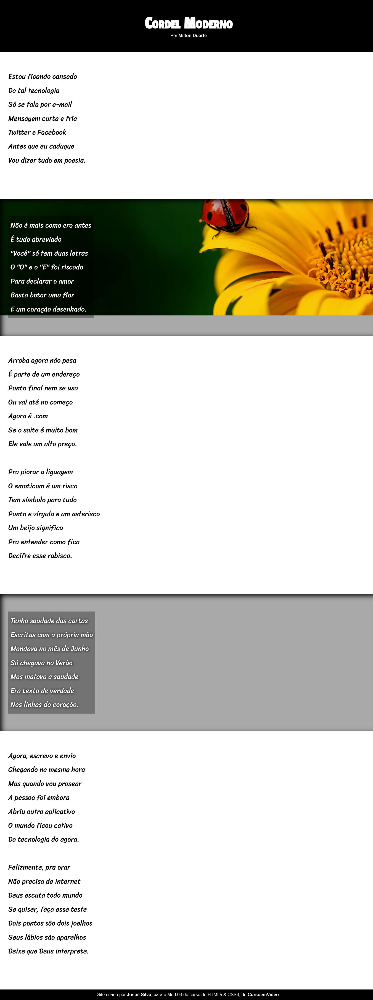

# 🪢 Projeto Cordel
## <strong>Projeto de site com efeito paralax, criado no Capítulo 20 do Curso de HTML e CSS, do Curso em Video</strong> 🖖
- <a href="https://www.youtube.com/playlist?list=PLHz_AreHm4dkZ9-atkcmcBaMZdmLHft8n"><strong>Acesse aqui o curso!</strong><a>

 

 

> # <a href="https://josuedevgit.github.io/projeto-cordel/">Acesse aqui o projeto!</a>

 

## 🔨⚒ Tools:

 

>### Insights 💡:
- Fora novamnete exercitarmos a estrutura semântica das páginas, aprendemos nesse módulo sobre o uso das imagem com a propriedade <code>background</code>.
- Aplicamos imagens conforme o tamanho das "caixas HTML" e com isso, criamos o chamado "Efeito Paralax".

 

>## 📩 Contato do Desenvolvedor:
- josueluzsilva.01@gmail.com
